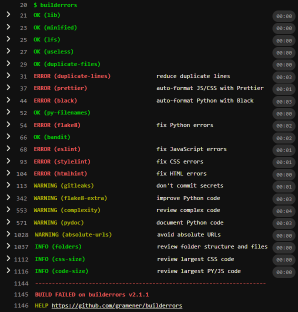

# Build Errors

Run automated checks on repositories to improve code quality.



- You can install and run it in
  - [Gitlab CI](#gitlab-ci-usage)
  - [Docker](#docker-usage)
  - [BitBucket Pipelines](#bitbucket-pipelines-usage)
  - [Jenkins](#jenkins-usage)
  - [Local](#local-usage)
- Here are instructions on how to fix each error:
  - [ERROR (lib) don't commit libraries](#lib)
  - [ERROR (minified) don't commit minified files](#minified)
  - [ERROR (lfs) use Git LFS for large files](#lfs)
  - [ERROR (useless) don't commit useless/generated files](#useless)
  - [ERROR (duplicate-files) delete duplicate files](#duplicate-files)
  - [ERROR (duplicate-lines) reduce duplicate lines](#duplicate-lines)
  - [ERROR (prettier) auto-format JS/CSS with Prettier](#prettier)
  - [ERROR (black) auto-format Python with Black](#black)
  - [ERROR (py-filenames) use lower_alpha Python paths](#py-filenames)
  - [ERROR (flake8) fix Python errors](#flake8)
  - [ERROR (bandit) fix Python security errors](#bandit)
  - [ERROR (eslint) fix JavaScript errors](#eslint)
  - [ERROR (data-blocks) move large data to JSON](#data-blocks)
  - [ERROR (stylelint) fix CSS errors](#stylelint)
  - [ERROR (htmlhint) fix HTML errors](#htmlhint)
  - [ERROR (gitleaks) don't commit secrets](#gitleaks)
  - [WARNING (js-modules) use JavaScript modules](#js-modules)
  - [WARNING (npm-audit) avoid unsafe npm packages](#npm-audit)
  - [WARNING (flake8-extra) improve Python code](#flake8-extra)
  - [WARNING (complexity) review complex code](#complexity)
  - [WARNING (url-templates) use URLSearchParams to construct URLs](#url-templates)
  - [WARNING (pydoc) document Python code](#pydoc)
  - [WARNING (absolute-urls) avoid absolute URLs](#absolute-urls)
  - [INFO (folders): review folder structure and files](#folders)
  - [INFO (css-size): review largest CSS code](#css-size)
  - [INFO (code-size) review largest PY/JS code](#code-size)
- [Alternatives](#alternatives)

## Gitlab CI usage

Add this on top of your [`.gitlab-ci.yml`](https://docs.gitlab.com/ee/ci/yaml/) file:

```yaml
validate:
  image: gramener/builderrors
  script: builderrors
```

If you used `gramex init` from [gramex](https://github.com/gramener/gramex) before version 1.84, change the following:

- Delete `.editorconfig`, `.htmllintrc` and `.stylelintrc.*`
- Copy this [`.eslintrc.yml`](.eslintrc.yml ":ignore") and run `npm install --save-dev eslint eslint-plugin-html eslint-plugin-template`
- If you have a `.flake8` or [equivalent](https://flake8.pycqa.org/en/latest/user/configuration.html), or [`.bandit`](https://bandit.readthedocs.io/en/latest/config.html#bandit-settings) file, switch to [ruff's pyproject.toml](https://docs.astral.sh/ruff/configuration/)

## Github Actions usage

Create a [`.github/workflows/validate.yml`](https://docs.github.com/en/actions/reference/workflow-syntax-for-github-actions):

```yaml
name: Run build errors
on: [push, pull_request]
jobs:
  validate:
    runs-on: ubuntu-latest
    steps:
      - uses: actions/checkout@v3
      - uses: docker://gramener/builderrors
```

## Docker usage

From the folder you want check, run this command on Linux:

<!--
  Why use "--rm"? To delete the container after it runs
  Why use "-it"? Some tools (e.g. jscpd) print colorized output only on interactive terminals
  Why use "-v `pwd`:/src"? For container to access current host directory at /src (the workdir)
-->

```bash
docker run --rm -it -v `pwd`:/src gramener/builderrors
```

On Windows Command Prompt:

```bat
docker run --rm -it -v %cd%:/src gramener/builderrors
```

On Windows PowerShell:

```powershell
docker run --rm -it -v ${PWD}:/src gramener/builderrors
```

To log into the container and run commands, use:

```bash
docker run --rm -it -v `pwd`:/src gramener/builderrors /bin/sh -l
# Now run `builderrors` or any other command
```

## BitBucket Pipelines usage

To run checks on every push with [BitBucket](https://bitbucket.org/product/features/pipelines),
add this on top of your [`bitbucket-pipelines.yml`](https://support.atlassian.com/bitbucket-cloud/docs/configure-bitbucket-pipelinesyml/):

```yaml
clone:
  lfs: true

pipelines:
  default:
    - step:
        name: validate
        image: gramener/builderrors
        script:
          - builderrors
```

## Jenkins usage

To run checks on every push with [Jenkins pipelines](https://www.jenkins.io/doc/book/pipeline/),
add this to your [`Jenkinsfile`](https://www.jenkins.io/doc/book/pipeline/jenkinsfile/) file:

```jenkinsfile
pipeline {
    stages {
        stage('Build errors') {
            agent {
                docker { image 'gramener/builderrors' }
            }
            steps {
                sh 'builderrors'
            }
        }
    }
}
```

## Local usage

- [Install Python 3.x](https://www.python.org/downloads/)
- [Install Node.js](https://nodejs.org/en/)
- [Install git](https://git-scm.com/download)
- [Install git-lfs](https://git-lfs.github.com/)

In `bash` or Git Bash, from any folder (e.g. `C:/projects/`) run this:

```bash
git clone https://github.com/gramener/builderrors
cd builderrors
bash setup.sh
```

From the folder _you want to test_, run this in `bash` or Git Bash:

```bash
bash /wherever-you-installed/builderrors
```

How to fix install errors:

- `Cannot uninstall 'PyYAML'. It is a distutils installed project ...`: Run [`pip install --ignore-installed PyYAML`](https://stackoverflow.com/a/53534728/100904) first
- `'bash' is not recognized as an internal or external command`: Run in bash or Git bash, not the Command Prompt or PowerShell
- `flake8: No such file or directory` or `pyminify: command not found`: Ensure you can run `python`, `node` and `git` in the same `bash` shell, and re-install

## It checks only committed files

`builderrors` only runs on a **git repository** with **committed** files.

It **WON'T** check untracked or `.gitignore`d files.

## Options

You can pass options as command-line parameters. For example:

```bash
# Report errors only if 100+ lines are duplicated or if Python code lines are over 120 chars
docker run --rm -it -v $(pwd):/src gramener/builderrors \
  builderrors --duplicate-lines=100000 --py-line-length=120

# Same check for local usage
bash /path/to/builderrors --duplicate-lines=100000 --py-line-length=120
```

### Skip checks

To skip specific checks, use `--skip=`. For example, to skip Flake8 and ESLint, use:
`--skip=flake8 --skip=eslint`.

See [List of checks](#list-of-checks) for the full list of checks.

You cannot use [`--only`](#run-only-specific-checks) along with `--skip`.

### Run only specific checks

To run only specific checks, use `--only=`. For example, to only run Flake8 and ESLint, use:
`--only=flake8 --only=eslint`

See [List of checks](#list-of-checks) for the full list of checks.

You cannot use [`--skip`](#skip-checks) along with `--only`.

### Convert to warnings

To run specific checks as a warning (i.e. report it but don't fail the build), use `--warning=`.
For example, to only warn on Flake8 and ESlint, use `--warning=flake8 --warning=eslint`

See [List of checks](#list-of-checks) for the full list of checks and the default error/warning status.

### Convert to errors

To run specific checks as errors (i.e. fail the build if the check fails), use `--error=`.
For example, to raise an error on NPM Audit and PyDoc, use `--error=npm-audit --error=pydoc`

See [List of checks](#list-of-checks) for the full list of checks and the default error/warning status.

### Environment variable options

You can also pass options as environment variables. (Command line overrides environment variables.) For example:

```bash
# Skip flake8. Report errors only if 100+ lines are duplicated
docker run --rm -it -v $(pwd):/src \
  -e SKIP_FLAKE8=1 -e DUPLICATE_LINES=100 \
  builderrors gramener/builderrors

# Skip Git LFS, eslint and stylelint
SKIP_LFS=1 SKIP_ESLINT=1 SKIP_STYLELINT=1 bash /path/to/builderrors
```

On Gitlab, set [environment variables](https://docs.gitlab.com/ce/ci/variables/)
under Settings > CI / CD > Variables.

### List of checks

Here are list of [`--skip`](#skip-checks) options for checks:

| Environment variable     | Command line             | Type    | Meaning                                  |
| ------------------------ | ------------------------ | ------- | ---------------------------------------- |
| `SKIP_LIB=1`             | `--skip=lib`             | ERROR   | Skip [libraries](#lib)                   |
| `SKIP_MINIFIED=1`        | `--skip=minified`        | ERROR   | Skip [minified file](#minified)          |
| `SKIP_LFS=1`             | `--skip=lfs`             | ERROR   | Skip [Git LFS](#lfs)                     |
| `SKIP_PRETTIER=1`        | `--skip=prettier`        | ERROR   | Skip [Prettier](#prettier)               |
| `SKIP_USELESS=1`         | `--skip=useless`         | ERROR   | Skip [useless files](#useless)           |
| `SKIP_DUPLICATE_FILES=1` | `--skip=duplicate-files` | ERROR   | Skip [duplicate files](#duplicate-files) |
| `SKIP_DUPLICATE_LINES=1` | `--skip=duplicate-lines` | ERROR   | Skip [duplicate lines](#duplicate-lines) |
| `SKIP_PY_FILENAMES=1`    | `--skip=py-filenames`    | ERROR   | Skip [Python filename](#py-filenames)    |
| `SKIP_BLACK=1`           | `--skip=black`           | ERROR   | Skip [Python Black](#black)              |
| `SKIP_FLAKE8=1`          | `--skip=flake8`          | ERROR   | Skip [flake8](#flake8)                   |
| `SKIP_BANDIT=1`          | `--skip=bandit`          | ERROR   | Skip [bandit](#bandit)                   |
| `SKIP_ESLINT=1`          | `--skip=eslint`          | ERROR   | Skip [eslint](#eslint)                   |
| `SKIP_STYLELINT=1`       | `--skip=stylelint`       | ERROR   | Skip [stylelint](#stylelint)             |
| `SKIP_HTMLHINT=1`        | `--skip=htmlhint`        | ERROR   | Skip [htmlhint](#htmlhint)               |
| `SKIP_NPM_AUDIT=1`       | `--skip=npm-audit`       | WARNING | Skip [npm audit](#npm-audit)             |
| `SKIP_GITLEAKS=1`        | `--skip=gitleaks`        | WARNING | Skip [gitleaks](#gitleaks)               |
| `SKIP_FLAKE8_EXTRA=1`    | `--skip=flake8-extra`    | WARNING | Skip [flake8 extra](#flake8-extra)       |
| `SKIP_COMPLEXIY=1`       | `--skip=complexity`      | WARNING | Skip [complexity](#complexity)           |
| `SKIP_DATA_BLOCKS=1`     | `--skip=data-blocks`     | WARNING | Skip [data-blocks](#data-blocks)         |
| `SKIP_URL_TEMPLATES=1`   | `--skip=url-templates`   | WARNING | Skip [url-templates](#url-templates)     |
| `SKIP_PYDOC=1`           | `--skip=pydoc`           | WARNING | Skip [pydoc](#pydoc)                     |
| `SKIP_ABSOLUTE_URLS=1`   | `--skip=absolute-urls`   | WARNING | Skip [absolute URLs](#absolute-urls)     |
| `SKIP_FOLDERS=1`         | `--skip=folders`         | INFO    | Skip [folders](#folders)                 |
| `SKIP_CSS_SIZE=1`        | `--skip=css-size`        | INFO    | Skip [CSS size](#css-size)               |
| `SKIP_CODE_SIZE=1`       | `--skip=code-size`       | INFO    | Skip [PY/JS size](#code-size)            |

Replace `--skip=` or `SKIP_` with:

- [`--only=` or `ONLY_` to run only specific checks](#run-only-specific-checks)
- [`--warning=` or `WARN_` to convert to warnings](#convert-to-warnings)
- [`--error=` or `ERROR_` to convert to errors](#convert-to-errors)

Other options include:

| Environment variable       | Command line               | Meaning                                                           |
| -------------------------- | -------------------------- | ----------------------------------------------------------------- |
| `SKIP_ESLINT_DEFAULT=1`    | `--skip=eslint-default`    | Don't copy `.eslintrc.yml` even if `.eslintrc.*` is missing       |
| `SKIP_STYLELINT_DEFAULT=1` | `--skip=stylelint-default` | Don't copy `.stylelintrc.yml` even if `.stylelintrc.*` is missing |
| `LFS_SIZE=n`               | `--lfs-size=n`             | Files over `n` bytes should use Git LFS (default: 1,000,000)      |
| `DUPLICATE_FILESIZE=n`     | `--duplicate-filesize=n`   | Files over `n` bytes should not be duplicated (default: 100)      |
| `DUPLICATE_LINES=n`        | `--duplicate-lines=n`      | Duplicate code over `n` lines are not allowed (default: 25)       |
| `PY_LINE_LENGTH=n`         | `--py-line-length=n`       | Approx line length of Python code used by Black (default: 99)     |
| `MAX_JS_COMPLEXITY=n`      | `--max-js-complexity=n`    | Report JS functions with `>n` cyclomatic complexity               |
| `MAX_PY_COMPLEXITY=n`      | `--max-py-complexity=n`    | Report PY functions with `>n` cyclomatic complexity               |

# How to fix errors

[`builderrors`](builderrors ":ignore") reports these errors:

## `lib`

```text
ERROR (lib) don't commit libraries. 15 min
```

`node_modules` (or `bower_components`) should be installed via `npm install` in each environment

- Run `git rm -rf node_modules/ bower_components/` to remove the libraries
- Add `bower_components/` and `node_modules/` to your `.gitignore`
- To skip this check, use `builderrors --skip=libraries` (e.g. to share a git repo for offline installation)

## `minified`

```text
ERROR (minified) don't commit minified files. 15 min
```

Minified files are not source code and shouldn't be version-controlled. They're generated

- Run `git rm jquery.min.js ...other.min.js` to remove the file
- Run `npm install your-package-name` to install the package
- Change URLs to point to the package (e.g. `node_modules/<lib>/dist/<lib>.min.js`)
- To skip this check, use `builderrors --skip=minified` (e.g. if the package is not on npm)

## `lfs`

```text
ERROR (lfs) use Git LFS for large files. 15 min
```

Git stores copies of every version. LFS stores pointers instead

- Install [Git LFS](https://git-lfs.github.com/)
- Run `git lfs install` on your repo
- For each large file(s), run these commands on `bash` or Git bash: [see help](https://git-lfs.github.com/)
  <!-- Dummy comment to avoid MD031/blanks-around-fences -->
  ```bash
  git rm your-large-file.ext          # Remove and commit
  git commit -m"Remove your-large-file.txt"
  git lfs track your-large-file.ext   # Use Git LFS for your file(s)
  # Copy your-large-file.ext back
  git add your-large-file.ext         # Add and commit
  git commit -m"Use LFS for your-large-file.txt`
  ```
  <!-- Dummy comment to avoid MD031/blanks-around-fences -->
- To skip this check, use `builderrors --skip=lfs` (e.g. if you can't use LFS)

## `useless`

```text
ERROR (useless) don't commit useless/generated files. 15 min
```

Thumbnails (`thumbs.db`), backups (`*~`), etc don't need to be committed. Nor logs (`*.log`)

- Run `git rm <useless.file>` to remove it
- Add `<useless.file>` to your `.gitignore`
- To skip this check, use `builderrors --skip=useless` (e.g. if you DO need to commit `.log` files)

## `duplicate-files`

```text
ERROR (duplicate-files) delete duplicate files. 10 min/error
```

You can re-use the same file

- Run `git rm <duplicate.file>` to remove it
- Replace `<duplicate.file>` with the retained file in your code
- To allow duplicate files less than 1000 bytes, run `builderrors --duplicate-filesize=1000`
- To skip this check, use `builderrors --skip=duplicate-files` (e.g. if you need duplicate files for test cases)

## `duplicate-lines`

```text
ERROR (duplicate-lines) reduce duplicate lines. 15 min/error
```

You can re-use the same code

- Use **loops** for code repeated one after another
- Use **functions** for code repeated in different places (either in the same file or different files)
- Use **function parameters** to handle minor variations in the repetition
- Use **data structures** for larger variations. For example, create an array or
  dictionary that stores all the parameters that vary. Remember: you can use functions as values
- Use **function generators** for extreme variations in code. Write a function
  to create and return a new function depending on your variation
- Refactor the code and test _very carefully_. (Unit test cases help here)
- To ignore duplicates up to 100 lines, run `builderrors --duplicate-lines=100`
- To skip this check, use `builderrors --skip=duplicate-lines` (e.g. if you need duplicate code for test cases)

## `prettier`

```text
ERROR (prettier) auto-format JS/CSS with Prettier. 2 min
```

It's important to have consistent formatting for readability. We use [prettier](https://prettier.io).

Use the [VS Code Prettier - Code Formatter plugin](https://marketplace.visualstudio.com/items?itemName=esbenp.prettier-vscode)
to auto-format your code.

**Don't format HTML templates** like Tornado / Lodash. [Prettier does not support templates](https://github.com/prettier/prettier/issues/5581)

<!--
- Go templates have a plugin: https://github.com/NiklasPor/prettier-plugin-go-template
- Django plugin is incomplete: https://github.com/robertquitt/prettier-plugin-djangohtml
- Jinja plugin for VS Code: https://github.com/samuelcolvin/jinjahtml-vscode
- Django plugin for VS Code: https://github.com/vscode-django/vscode-django
- Unibeautify supports templates: https://github.com/unibeautify/unibeautify
-->

- To auto-fix, run `npx prettier@3.2 --write "**/*.{js,mjs,ts,jsx,tsx,vue,css,scss,sass,yml,yaml,md}"`
- To ignore specific files, add a [`.prettierignore`](https://prettier.io/docs/en/ignore.html) file (e.g. add `*.html`)
- To ignore [specific rules](https://prettier.io/docs/en/options.html), add a [`.prettierrc`](https://prettier.io/docs/en/configuration.html) file
- To skip this check, use `builderrors --skip=prettier` (e.g. if you temporarily need the build to pass)

## `black`

```text
ERROR (black) auto-format Python with Black. 2 min
```

It's important to have consistent formatting for readability. We use [black](https://black.readthedocs.io/) for Python files.

Use the [VS Code Prettier - Black plugin](https://marketplace.visualstudio.com/items?itemName=ms-python.black-formatter)
to auto-format your code.

- To auto-fix, run:
  - `pip install black` (one-time)
  - `black . --skip-string-normalization --line-length=99`
- To ignore [specific rules](https://prettier.io/docs/en/options.html), add a [`pyproject.toml`](https://black.readthedocs.io/en/stable/usage_and_configuration/the_basics.html#configuration-via-a-file) file
- To skip this check, use `builderrors --skip=black` (e.g. if you temporarily need the build to pass)

Troubleshooting:

- `black is not recognized as an internal or external command`
  - **FIX**: `pip install black`
- `pip install black` raises a `PermissionError`
  - **FIX**: `pip install --user black` instead of `pip install black`

## `py-filenames`

```text
ERROR (py-filenames) use lower_alpha Python paths. 5 min/error
```

You can't import a Python file unless it has alphanumeric letters. Using lowercase is the convention.

- Rename the Python files using lower case alphanumerics and underscore (`_`)
- To skip this check, use `builderrors --skip=py-filenames` (e.g. if you won't be importing the module)

## `flake8`

```text
ERROR (flake8) fix Python errors. 1 min/error
```

[ruff](https://docs.astral.sh/ruff/) checks for flake8 errors with these rules:

- [pyflakes](https://docs.astral.sh/ruff/rules/#pyflakes-f)
- [pycodestyle](https://docs.astral.sh/ruff/rules/#pycodestyle-e-w)
- [flake8-2020](https://docs.astral.sh/ruff/rules/#flake8-2020-ytt): catches misuse of `sys.version` or `sys.version_info`
- [flake8-bugbear](https://docs.astral.sh/ruff/rules/#flake8-bugbear-b): catches potential bugs
- [flake8-comprehensions](https://docs.astral.sh/ruff/rules/#flake8-comprehensions-c4): simplifies list/dict comprehensions
- [flake8-debugger](https://docs.astral.sh/ruff/rules/#flake8-debugger-t10): catches `pdb`, `ipdb` and `breakpoint()`
- [flake8-print](https://docs.astral.sh/ruff/rules/#flake8-print-t20): catches print statements (use `logging` instead)
- [pep8-naming](https://docs.astral.sh/ruff/rules/#pep8-naming-n): standardizes variable names

Notes:

- To run locally, use `ruff check --select E,W,F,YTT,B,C4,T10,T20,N`
- To auto-fix, run `ruff check --select E,W,F,YTT,B,C4,T10,T20,N --fix`
- To ignore a specific line, add [`# noqa: <error-number>`](https://docs.astral.sh/ruff/linter/#detecting-unused-suppression-comments) at the end, e.g. `print("\n") # noqa: T201`
- To ignore specific rules, add to [ruff's `pyproject.toml`](https://docs.astral.sh/ruff/configuration/) file
- To skip this check, use `builderrors --skip=flake8` (e.g. if you temporarily need the build to pass)

## `bandit`

```text
ERROR (bandit) fix Python security errors. 30 min/error
```

[ruff](https://docs.astral.sh/ruff/) checks for [Bandit](https://bandit.readthedocs.io/) security errors in Python.

- Re-write the code based on advice from bandit
- To ignore a specific line, add a [`# noqa: <error-number>`](https://docs.astral.sh/ruff/linter/#detecting-unused-suppression-comments) at the end
  - To retain [`# nosec`](https://bandit.readthedocs.io/en/latest/config.html#exclusions) for `bandit`, use `# nosec # noqa: <error-number>`
- To skip this check, use `builderrors --skip=bandit` (e.g. if there are too many false-positives)

## `eslint`

```text
ERROR (eslint) fix JavaScript errors. 30 sec/error
```

[ESLint](https://eslint.org/) reports JavaScript errors in JS and HTML files -- including HTML templates.

- To auto-fix, run `npx eslint --fix`
- To ignore a specific line, add a [`// eslint-disable-line`](https://eslint.org/docs/latest/user-guide/configuring/rules#disabling-rules) at the end
- To ignore specific rules, add a [`.eslintrc.yml`](http://eslint.org/docs/rules/) based on the [default](.eslintrc.yml ":ignore")
- To skip this check, use `builderrors --skip=eslint` (e.g. if you temporarily need the build to pass)

Common errors:

- **[`'x' is not defined. [Error/no-undef]`](http://eslint.org/docs/rules/no-undef)**
  - [Add in your `.js`](https://eslint.org/docs/latest/user-guide/configuring/language-options#using-configuration-comments-1): `/* globals x, ... */`.
  - [Add in `.eslintrc.yml`](https://eslint.org/docs/latest/user-guide/configuring/language-options#using-configuration-files-1) for libraries like `d3`, `$`, `_`, etc.: `"globals": {"d3": "readonly", ...}`
- **[`'x' is assigned a value but never used. [Error/no-unused-vars]`](http://eslint.org/docs/rules/no-unused-vars)**
  - [Add in your `.js`](https://eslint.org/docs/latest/rules/no-unused-vars#exported): `/* exported x, ... */` (or don't assign to the variable)

## `data-blocks`

```text
ERROR (data-blocks) move large data to JSON. 5 min/error
```

Avoid large data blocks in your code. Keep code and data separate.

Move data into JSON files (or CSV or any other data file).

Reference: [eslint-plugin-no-data-blocks](https://www.npmjs.com/package/eslint-plugin-no-data-blocks)

## `stylelint`

```text
ERROR (stylelint) fix CSS errors. 3 min/error
```

[stylelint](https://stylelint.io/) reports CSS and SASS errors.

- Re-write the code based on advice from stylelint
- To ignore a specific line, add a [`/* stylelint-disable-line */`](https://stylelint.io/user-guide/ignore-code) at the end
- To ignore specific rules, add a [`.stylelintrc.yml`](https://stylelint.io/user-guide/configure) file based on the [default](.stylelintrc.yml ":ignore"). For example:
  - `"selector-no-unknown": null` allows styling custom web components
- To skip this check, use `builderrors --skip=stylelint` (e.g. if you're using third-party provided CSS)

## `htmlhint`

```text
ERROR (htmlhint) fix HTML errors. 5 min/error
```

[htmlhint](https://htmlhint.com/) checks HTML and reports errors.

- Re-write the code based on advice from htmlhint
- To ignore specific rules, add a [`.htmlhintrc`](https://htmlhint.com/docs/user-guide/getting-started) file based on the [default](.htmlhintrc ":ignore")
- To skip this check, use `builderrors --skip=htmlhint` (e.g. if you're building a Lodash template library)

## `gitleaks`

```text
ERROR (gitleaks) don't commit secrets. 30 min/error
```

[gitleaks](https://github.com/zricethezav/gitleaks) detects hardcoded passwords, API keys, and tokens in git repos.

To fix these, change the password, key or token and delete the key.

[`.gitleaksignore` file](https://github.com/zricethezav/gitleaks#gitleaksignore) ignores fragments. Use with care.

<!--
Optionally, [rewrite the commit history](https://docs.github.com/en/authentication/keeping-your-account-and-data-secure/removing-sensitive-data-from-a-repository)
using [BFG repo-cleaner](https://rtyley.github.io/bfg-repo-cleaner/) or [git filter-repo](https://github.com/newren/git-filter-repo).
-->

## `js-modules`

```text
WARNING (js-modules) use JavaScript modules. 30 min/error
```

[`JavaScript modules`](https://developer.mozilla.org/en-US/docs/Web/JavaScript/Guide/Modules)
are the modern way of including JavaScript.

- Change `<script>` to `<script type="module">`
- Consider using [lebab](https://www.npmjs.com/package/lebab) or
  [ES5 to ES6](https://marketplace.visualstudio.com/items?itemName=jeremyrajan.vscode-lebab)
- Test your code!

## `npm-audit`

```text
WARNING (npm-audit) avoid unsafe npm packages. 15 min/error
```

[`npm audit`](https://docs.npmjs.com/cli/v8/commands/npm-audit) checks for JavaScript package vulnerabilities.

- To auto-fix, run `npm audit fix`
- To upgrade all packages to the latest compatible version, run `npm upgrade`
- Change package versions manually and retry

## `flake8-extra`

```text
WARNING (flake8-extra) improve Python code. 5 min/error
```

[ruff](https://docs.astral.sh/ruff/) checks for additional flake8 errors. These are **OPTIONAL but GOOD** to fix.

- [flake8-eradicate](https://pypi.org/project/flake8-eradicate): reports commented code
- [flake8-simplify](https://pypi.org/project/flake8-simplify): suggests code simplifications

You can fix these exactly like [flake8 errors](#flake8)

## `complexity`

```text
WARNING (complexity) review complex code. 120 min/error
```

Break your code into smaller functions. Use clear function names. Re-use as much as possible.

## `url-templates`

```text
WARNING (url-templates) move large data to JSON. 5 min/error
```

Construct URL params with URLSearchParams not template literals. Instead of:

```js
const url = `path?city=${city}&time=${now}`;
```

... use:

```js
const url = `path?` + new URLSearchParams({ city, time: now }).toString();
```

This offers:

- Automatic Encoding: Special characters are safely encoded.
- Readability: The syntax is cleaner and more readable. It abstracts away the manual construction of the query string.
- Error Reduction: Reduces the chance of errors like missing an & or incorrectly encoding values.

Reference: [eslint-plugin-no-url-params-template](https://www.npmjs.com/package/eslint-plugin-no-url-params-template)

## `pydoc`

```text
WARNING (pydoc) document Python code. 15 min/error
```

Add a docstring to your public Python functions, classes and methods.

We recommend writing docstrings in Markdown (not ReST) in the
[Google style guide](https://mkdocstrings.github.io/griffe/docstrings/).

## `absolute-urls`

```text
WARNING (absolute-urls) avoid absolute URLs. 10 min/error
```

Avoid URLs that begin with `/`, e.g. `<a href="/login">` or ``. If the
application is deployed at a different path (e.g. at `https://example.org/app/` instead of
`https://example.org/`), these links will break.

Change URLs to relative paths,
e.g. `<a href="../login">` or `<a href="login">` or ``.

## `folders`

```text
INFO (folders): review folder structure and files
```

- Commit only necessary files
- Group files logically into folders

## `css-size`

```text
INFO (css-size): review largest CSS code
```

Shows the number of lines, words and characters in all CSS/SCSS files.

- Reduce CSS code using libraries
- To skip this check, use `builderrors --skip=css-size`

## `code-size`

```text
INFO (code-size) review largest PY/JS code.
```

Shows the number of lines, words and characters in all Python / JavaScript files.

- Reduce code using configurations, functions, and libraries
- To skip this check, use `builderrors --skip=code-size`

# Alternatives

Comprehensive open-source multi-linting tools are available at:

- [Super-Linter](https://github.com/github/super-linter)
- [MegaLinter Runner](https://github.com/oxsecurity/megalinter)
